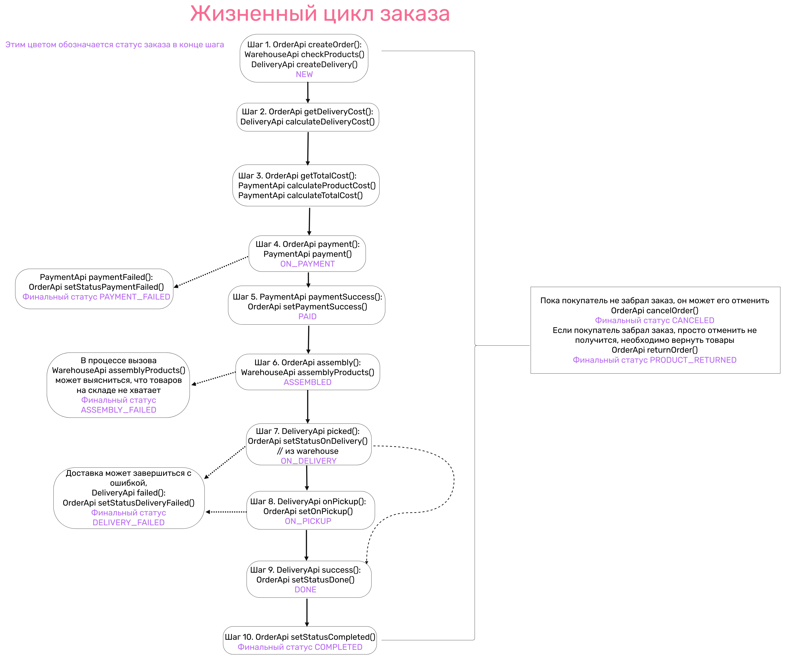

# Smart Home Technologies

Smart Home Technologies - компания специализируется на **продаже и обслуживании умных устройств** — датчиков движения,
освещённости и температуры.

Имеет микросервисную архитектуру (11 микросервисов). Для передачи данных используется REST API, gRPC, а также Kafka (по схемам Avro).

---

## Используемые Технологии

| Технология     | Версия   |
|:---------------|:---------|
| Spring Boot    | 3.3.2    |
| Spring Cloud   | 2023.0.3 |
| Kafka (client) | 3.6.1    |
| PostgreSQL     | 16.1     |
| gRPC           | 1.63.0   |
| Docker         | 4.36.0   |

---

## Спецификации Сервисов

Ниже представлены ссылки на спецификации для каждого ключевого сервиса:

* **[collector](specifiactions/collector.json)** - Принимает данные пользователей
* **[warehouse](specifiactions/warehouse.json)** - Информация о товарах на складе
* **[shopping-store](specifiactions/shopping-store.json)** - Информация о товарах для магазина
* **[shopping-cart](specifiactions/shopping-cart.json)** - Корзина пользователя
* **[order](specifiactions/order.json)** - Управление заказами
* **[delivery](specifiactions/delivery.json)** - Интеграция с сервисом доставки
* **[payment](specifiactions/payment.json)** - Интеграция с платёжным сервисом

---

## Жизненный цикл заказа

